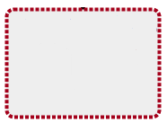

# Derived state

Each in a service model has an actual state and a derived state.

A device element's actual state is determined by events that occur on
the device, regardless of the service models in which it participates. A
service model member's actual state is generated from the service model
in its own service context. The element's derived state is generated
from policy propagation within a given context. In the Service Impact
graph, the symbol that appears inside the node's border reflects the
actual state; the border that outlines the node reflects the derived
state.

In the following example graph, the actual and derived states are down.
The parents of the device have a degraded and at-risk actual state, yet
the derived state based on the contextual policy, is degraded.

@lb

## Visual state indicators

The Impact View provides symbols and borders to visually
indicate availability, actual state, performance, and derived state, as
shown in the following table.

<table>
<tbody>
<tr markdown="1">
<th>Availability</th>
<th>Performance</th>
<th>Symbol / Actual State</th>
<th>Border / Derived State</th>
</tr>

<tr markdown="1">
<td>UP</td>
<td>ACCEPTABLE</td>
<td>

  

</td>
<td>

  

</td>
</tr>
<tr markdown="1">
<td>ATRISK</td>
<td>Not applicable.</td>
<td>

  

</td>
<td>

  

</td>
</tr>
<tr markdown="1">
<td>DEGRADED</td>
<td>DEGRADED</td>
<td>

  

</td>
<td>

  

</td>
</tr>
<tr markdown="1">
<td>DOWN</td>
<td>UNACCEPTABLE</td>
<td>

  

</td>
<td>

  

</td>
</tr>
</tbody>
</table>

A member's actual and derived states can be different. As shown in the
following example, a service's actual state can be up, but an applied
context policy changed its derived state to down.

@lb

