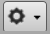

# Using Service Impact

The home page of the Service Impact feature is SERVICES &gt; DYNAMIC
SERVICES, which displays the health summaries of all dynamic services.

From the home page, you can choose the LOGICAL NODES or METATYPE
CONFIGURATION tabs.

@lb

## Tree view area

The tree view area displays service nodes and logical nodes in
alphabetical order. You can create organizers and order them as you
wish. To move service nodes and logical nodes into organizers, drag them
into the tree view.

<table>
<tbody>
<tr markdown="1">
<th rowspan="2">Tool</th>
<th colspan="3">Menu</th>
</tr>
<tr markdown="1">
<th>DYNAMIC SERVICES</th>
<th>LOGICAL NODES</th>
<th>METATYPE CONFIGURATION</th>
</tr>

<tr markdown="1">
<td>

  

</td>
<td>Add Dynamic Service 
Add Dynamic Service Organizer</td>
<td>Add Logical Node 
Add Logical Node Organizer</td>
<td>(no menu)</td>
</tr>
<tr markdown="1">
<td>

  

</td>
<td>(no menu)</td>
<td>(no menu)</td>
<td>(no menu)</td>
</tr>
<tr markdown="1">
<td>

  

</td>
<td>View and Edit Details 
Clone Service... 
Export Selected</td>
<td>(no menu)</td>
<td>Restore default settings</td>
</tr>
</tbody>
</table>

## Primary view area

The content of the primary view area depends on which tab is selected,
and for some tabs, which item is selected in the tree view area.

<table>
<tbody>
<tr markdown="1">
<th>Tab</th>
<th>Tree view selection</th>
<th>Primary view contents</th>
</tr>

<tr markdown="1">
<td rowspan="3">DYNAMIC SERVICES</td>
<td>DYNAMIC SERVICES (the root organizer)</td>
<td>The availability and performance health summaries of all services.</td>
</tr>
<tr markdown="1">
<td>An organizer</td>
<td>The availability and performance health summaries of the services that the organizer contains.</td>
</tr>
<tr markdown="1">
<td>A dynamic service (service model)</td>
<td>The Members of the selected service. From this view, select <a href="/imp/using/events-view.html">Impact Events</a> or <a href="/imp/using/impact-view.html">Impact View</a> .</td>
</tr>
<tr markdown="1">
<td rowspan="2">LOGICAL NODES</td>
<td><ul>
<li>LOGICAL NODES (the root organizer)</li>
<li>An organizer</li>
</ul></td>
<td>A blank <a href="/imp/using/logical-nodes.html">logical node details view</a> .</td>
</tr>
<tr markdown="1">
<td>A logical node</td>
<td>The details view of the selected logical node. No other views are associated with logical nodes.</td>
</tr>
<tr markdown="1">
<td>METATYPE CONFIGURATION</td>
<td>The list of ZenPacks with metatypes defined</td>
<td>The components that can be excluded from all dynamic services that include the components.</td>
</tr>
</tbody>
</table>

