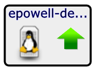

# Impact view

The Impact View displays the interactive Service Impact graph of a
service model and provides several views and tools.

@lb

## Service context (root) node name

In the upper left above the Aspect controls, the service context (root)
node of the graph is displayed, along with its tree view path. Click the
name to make the root node the selected node and display its name in the
Selected node field.

## Aspect views: Availability, Performance

Use aspect views to display and filter on availability or performance
states in the graph.

## Selected Node

Displays the name and type of the node that you have chosen, or the
service context (root) node if you have not chosen a node. For example,
DB Hosts (Organizing Group) is the node named DB Hosts, which is an
organizing group type. When you first access the Impact View, the
Selected Node field displays the root node. To resize the Selected Node
field, hover the pointer to the left of the field label to display the
resize tool, and then drag the tool left or right. When you choose a
node from the list or click a tile in the graph, that node appears in
Selected Node and the node tile is centered in the graph.

To search for specific nodes, begin typing a string in the Selected Node
field. The field's drop-down list displays matching nodes in the
following format:

`node_name (node_type) [UID]`

Tips for searching nodes:

-   Strings are not case sensitive.
-   Regular expressions are not supported.
-   You can search for nodes by name, type, or system-generated unique
    identifier (UID).
-   To search for nodes by name only, suffix the search string with an
    open parenthesis. For example, the following string matches only
    node names that end with "Hosts," such as the DB Hosts node.

    `Hosts (`

    However, the following string matches nodes with "hosts" in the name
    or type.

    `hosts`

-   To search for nodes by type only, prefix the search string with an
    open parenthesis. For example, the following string matches only
    node types beginning with "vSphere," such as the vSpherePnic type.

    `(vSphere`

    However, the following string matches nodes with "vsphere" in the
    name or type.

    `vSphere`

-   To search for nodes that contain the same character string in the
    UID, prefix the search string with an open bracket. For example, the
    following string matches only nodes with a UID beginning with "G7M,"
    such as G7M589.

    `[G7M`              However, the following string matches nodes with "G7M" in the name,     type, or UID.              `G7M`  # Zoom

To increase or decrease the size of tiles in the graph, use the mouse
wheel or drag the Zoom control in the upper right corner of the view.

## Node tools

To see a summary of a node in a Service Impact graph, hover the pointer
over its tile. Summary information includes the node name, availability
state, performance status, production status, and type.

To display the following menu options for a node, position the pointer
over it and right-click:

Toggle Children

Hide or display the node's child and descendent nodes.

Edit Impact Policies

Display the Impact Policies dialog box. See [Impact Policies dialog box](/imp/using/impact-view3.html). Note, Impact Policies
for Availability and Performance are set separately, depending on which
aspect is selected.

Center view on node

Adjust the view so the selected node is in the center of the display
area.

## Graph and filter tools (right-click menu)

To display the following Impact View menu options, position the pointer
in the primary view area and right-click.

|Menu option|Description|
|-----------|-----------|
|Fit Graph to Window|Adjust the size of the graph so that its dimensions match the display area.|
|Show All|Display all nodes in the graph, including those that are automatically added by ZenPacks.|
|Collapse All|Display only the top-level node of the graph.|
|Compact View|Display only the service model members that you have manually added and the immediate children of a service or service group.|
|Toggle Rainbows|Display colored tabs at the right edge of the node, indicating the number of critical, error, and warning events associated with the node.|
|Show Filters|Hide or display the filter controls.    Use filter check boxes to select availability and performance states by which to filter. By default, all states are selected for filtering. To restrict displayed nodes to specific states, such as DOWN and UNACCEPTABLE, select only those check boxes. (Changes to the selected states apply to all dynamic services because state is a global feature.)  To filter by complete or partial node name, use the Name field. To perform the filter click Filter.|
|Export Graph Image|Creates a file of the graph image with the default name graph.png and downloads it to your workstation.|
|Enable center view|Shift the graph so that the selected node is in the center. The zoom level does not change. You can zoom in and out on the node in the center of the graph. Choose this option to recenter a specific node.|
|Jump to Selected|Shift the graph so that the node that is shown in the Selected Node field is in the center.|
|Jump to Context (root)|Shift the graph so that the service context (root) node of the graph is in the center.|

<!---  //Commenting out the old layout in favor of a toble.//
Fit Graph to Window

Adjust the size of the graph so that its dimensions match the display
area.

Show All

Display all nodes in the graph, including those that are automatically
added by ZenPacks.

Collapse All

Display only the top-level node of the graph.

Compact View

Display only the service model members that you have manually added and
the immediate children of a service or service group.

Toggle Rainbows

Display colored tabs at the right edge of the node, indicating the
number of critical, error, and warning events associated with the node.

Show Filters

Hide or display the filter controls.

Use filter check boxes to select availability and performance states by
which to filter. By default, all states are selected for filtering. To
restrict displayed nodes to specific states, such as DOWN and
UNACCEPTABLE, select only those check boxes. (Changes to the selected
states apply to all dynamic services because state is a global feature.)

To filter by complete or partial node name, use the Name field. To
perform the filter click Filter.

Export Graph Image

Creates a file of the graph image with the default name graph.png and
downloads it to your workstation.

Enable center view

Shift the graph so that the selected node is in the center. The zoom
level does not change. You can zoom in and out on the node in the center
of the graph. Choose this option to recenter a specific node.

Jump to Selected

Shift the graph so that the node that is shown in the Selected Node
field is in the center.

Jump to Context (root)

Shift the graph so that the service context (root) node of the graph is
in the center.
-->

## Node tiles

The node tile graphically represents a server or service node and
information about it, as described in the following table:

<table>
<tbody>
<tr markdown="1">
<th>Node tile example</th>
<th>Description</th>
</tr>

<tr markdown="1">
<td>

  

</td>
<td>This tile represents a Linux server named epowell-debug.zenoss.loc. (The name is shortened to fit inside the tile.)
<ul>
<li>The computer icon and penguin image represent the node's type, Linux server.</li>
<li>The green arrow and the black border represent the node's availability state, UP.</li>
</ul></td>
</tr>
<tr markdown="1">
<td>

     

</td>
<td>This tile represents a service node with a global policy. Event rainbows are displayed.
<ul>
<li>The event rainbow is the colored tabs on the right side of the tile. From top to bottom, the rainbow shows the counts of critical, error, and warning events that are associated with the node. The first example node has no events, so no numbers are displayed. The second example node has 1 critical error.</li>
<li>When you click an event rainbow tab, Collection Zone displays the overview page of the node.</li>
<li>This tile includes three dots immediately below its bottom border. The dots represent descendant nodes. To display the descendant nodes, double-click the node tile.</li>
</ul></td>
</tr>
<tr markdown="1">
<td>

  

</td>
<td>This tile represents a service node. The yellow icon and border represent the node's availability state, ATRISK.</td>
</tr>
<tr markdown="1">
<td>

  

</td>
<td>This tile represents a service node with a global policy. The red arrow and the red border of the tile represent the node's availability state, DOWN.</td>
</tr>
</tbody>
</table>

## Impact Policies dialog box

In the Impact Policies dialog box, add or edit state triggers for
contextual or global policies.  Note, Impact Policies for Availability
and Performance are set separately, depending on which aspect is
selected.

@lb

To prevent sending service events when changes affect a node, check
Suppress service events. Choose this option when a service node is used
solely to group child nodes.

If a custom state provider is not associated with a node, the dialog box
does not contain the option to edit the custom state provider.

For a policy or custom state provider, click Add or Edit to access
options.

## Edit policy options (Availability)

Use the Edit Policy options to add or edit state triggers for contextual
or global policies.

@lb

To add a trigger, in the lower-left corner click Add. On the right side
of the dialog box, modify the trigger fields (described in the following
table), and then click Save Changes.

| Field            | Description                                                                                                     |
|:-----------------|:----------------------------------------------------------------------------------------------------------------|
|  My state will be| The new state, if the trigger applies. Possible states: DOWN, DEGRADED, ATRISK, UP.                             |
|  If              | The conditions that trigger a state change. To specify a percentage rather than an absolute value, click % .    |
|  Of type         | Restrict the type of child node to which the trigger applies. Types other than Any are exclusive.               |
|  Are             | The state of child nodes that cause an evaluation of this trigger. Possible states: DOWN, DEGRADED, ATRISK, UP. |

## Edit policy options (Performance)

Use the Edit Policy options to add or edit state triggers for contextual
or global policies.

@lb

To add a trigger, in the lower-left corner click Add. On the right side
of the dialog box, modify the trigger fields (described in the following
table), and then click Save Changes.

| Field            | Description                                                                                                              |
|:-----------------|:-------------------------------------------------------------------------------------------------------------------------|
|  My state will be| The new state, if the trigger applies. Possible states: UNACCEPTABLE, DEGRADED, ACCEPTABLE.                              |
|  If              | The conditions that trigger a state change. To specify a percentage rather than an absolute value, click % .             |
|  Of type         | Restrict the type of child node to which the trigger applies. Types other than Any are exclusive.                        |
|  Are             | The state of child nodes that cause an evaluation of this trigger. Possible states: UNACCEPTABLE, DEGRADED, ACCEPTABLE. |

## Edit Custom State Provider options

Use a custom state provider to add state triggers (rules) for custom
device and component service model members. You can customize Resource
Manager to gather state data from events that belong to other classes.
For example, you can customize state providers to define state triggers
for members that are monitored through customized classes that the
ZenVMware and CiscoUCS ZenPacks provide.

@lb

<table>
<tbody>
<tr markdown="1">
<th>Field</th>
<th>Description</th>
</tr>

<tr markdown="1">
<td> Event Class </td>
<td>Choose the Resource Manager event class to monitor. You can configure one event class per device.</td>
</tr>
<tr markdown="1">
<td>Event severity fields (Critical, Error, 
Warning, Info, Debug, Clear)</td>
<td>Choose the state for this member if the event severity is observed. Possible states are UP, ATRISK, DEGRADED, DOWN.</td>
</tr>
<tr markdown="1">
<td> Apply to </td>
<td>Choose the nodes (components) to which the state override applies.
<ul>
<li> This node only: The selected component on the specific device.</li>
<li> Nodes of the same type on the same device: The same component type on the same device. If a component is associated with another device, it is not affected in that context.</li>
<li> Nodes of the same type in the same device class: The same component type on any device with the same device class.</li>
<li> Nodes of the same type system-wide: The same component type, regardless of the device or the device class.</li>
</ul></td>
</tr>
</tbody>
</table>
