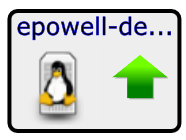
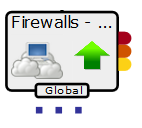
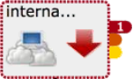
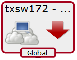

# Impact view2

The node tile graphically represents a server or service node and
information about it, as described in the following table:

<table>
<tbody>
<tr markdown="1">
<th>Node tile example</th>
<th>Description</th>
</tr>

<tr markdown="1">
<td>

  

</td>
<td>This tile represents a Linux server named epowell-debug.zenoss.loc. (The name is shortened to fit inside the tile.)
<ul>
<li>The computer icon and penguin image represent the node's type, Linux server.</li>
<li>The green arrow and the black border represent the node's availability state, UP.</li>
</ul></td>
</tr>
<tr markdown="1">
<td>

     

</td>
<td>This tile represents a service node with a global policy. Event rainbows are displayed.
<ul>
<li>The event rainbow is the colored tabs on the right side of the tile. From top to bottom, the rainbow shows the counts of critical, error, and warning events that are associated with the node. The first example node has no events, so no numbers are displayed. The second example node has 1 critical error.</li>
<li>When you click an event rainbow tab, Collection Zone displays the overview page of the node.</li>
<li>This tile includes three dots immediately below its bottom border. The dots represent descendant nodes. To display the descendant nodes, double-click the node tile.</li>
</ul></td>
</tr>
<tr markdown="1">
<td>

  

</td>
<td>This tile represents a service node. The yellow icon and border represent the node's availability state, ATRISK.</td>
</tr>
<tr markdown="1">
<td>

  

</td>
<td>This tile represents a service node with a global policy. The red arrow and the red border of the tile represent the node's availability state, DOWN.</td>
</tr>
</tbody>
</table>

